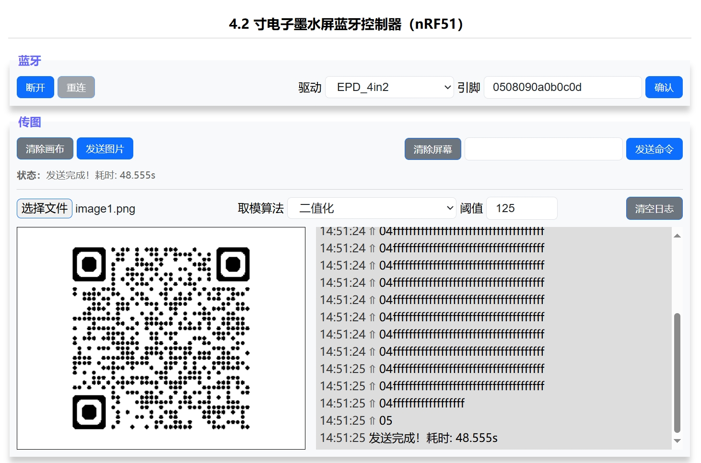

# EPD42

[中文](README.md)

4.2 inch e-ink screen firmware with a [web-based upper computer](https://pengwon.github.io/epd42/) that can transfer images to the e-ink screen via Bluetooth.

Theoretically supports all nRF51 series MCUs, built-in 3 micro-snow 4.2 inch e-ink screen drivers (switchable), also supports custom e-ink screen to MCU pin mapping, supports sleep wake-up (NFC / wireless charger).

## Supported Devices

The hardware is hacked from a 4.2 inch e-ink price tag available on e-commerce platforms, you can [click here to buy](https://item.taobao.com/item.htm?ft=t&id=874071462547), supports both black and white dual-color and black, white, and red tri-color versions.

- Black and White Dual-Color Version

  ```
  MCU: nRF51822
  RAM: 16K
  ROM: 128K

  Driver: UC8176 (EPD_4in2)
  Screen Pins: 0508090A0B0C0D
  Coil Pins: 07
  ```

  

- Black, White, and Red Tri-Color Version

  ```
  MCU: nRF51802
  RAM: 16K
  ROM: 256K

  Driver: UC8276C (EPD_4in2b_V2)
  Screen Pins: 0A0B0C0D0E0F10
  Coil Pins: 09
  LED Pins: 03/04/05 (three LEDs, any one can be used)
  ```

  

The default driver and pin mapping are for the black and white dual-color version, other versions need to switch drivers and modify pin mapping.

## Upper Computer

Address: https://pengwon.github.io/epd42/



Scan the QR code above to join the WeChat group for more information.

## Compilation Targets

- `nRF51822_xxAB`: Used to compile nRF51822 firmware, with built-in black and white dual-color version configuration
- `nRF51802_xxAA`: Used to compile nRF51802 firmware, with built-in black, white, and red tri-color version configuration
- `flash_softdevice` Target: Used to flash the Bluetooth protocol stack (only needs to be flashed once)

You can use J-Link or DAPLink as the programmer (you can use [RTTView](https://github.com/XIVN1987/RTTView) to view RTT logs).

**Flashing Process:**

> If you do not modify the code, it is recommended to download the binary firmware from [Releases](https://github.com/tsl0922/EPD-nRF51/releases) for immediate use.

1. Erase all (if Keil cannot erase, try using the programmer's upper computer software to erase)
2. Switch to the `flash_softdevice` Target corresponding to the MCU, **do not compile, just download** (only needs to be flashed once)
3. Switch to the Target corresponding to the MCU, compile first, then download

## Acknowledgements

- This project is forked from [EPD-nRF51](https://github.com/tsl0922/EPD-nRF51), thanks to the original author for sharing and contributing.